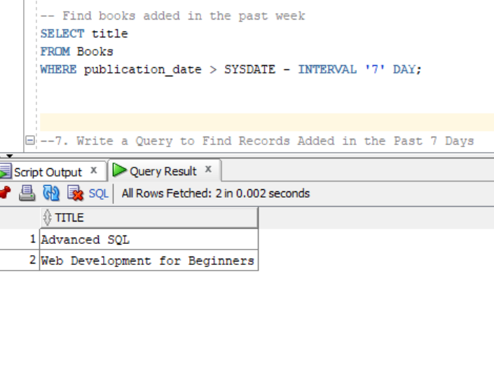
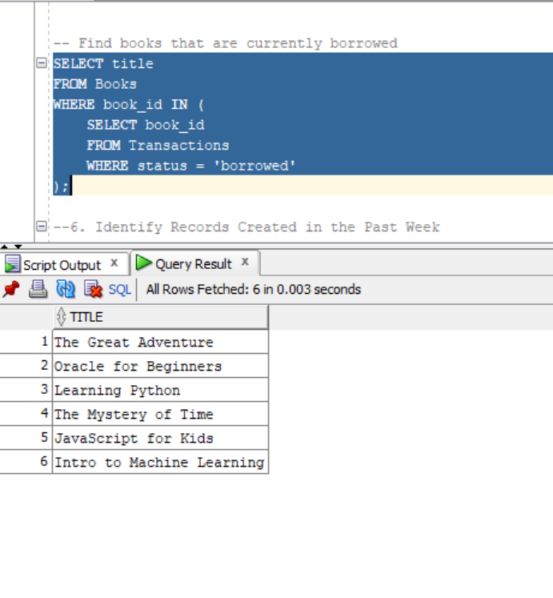
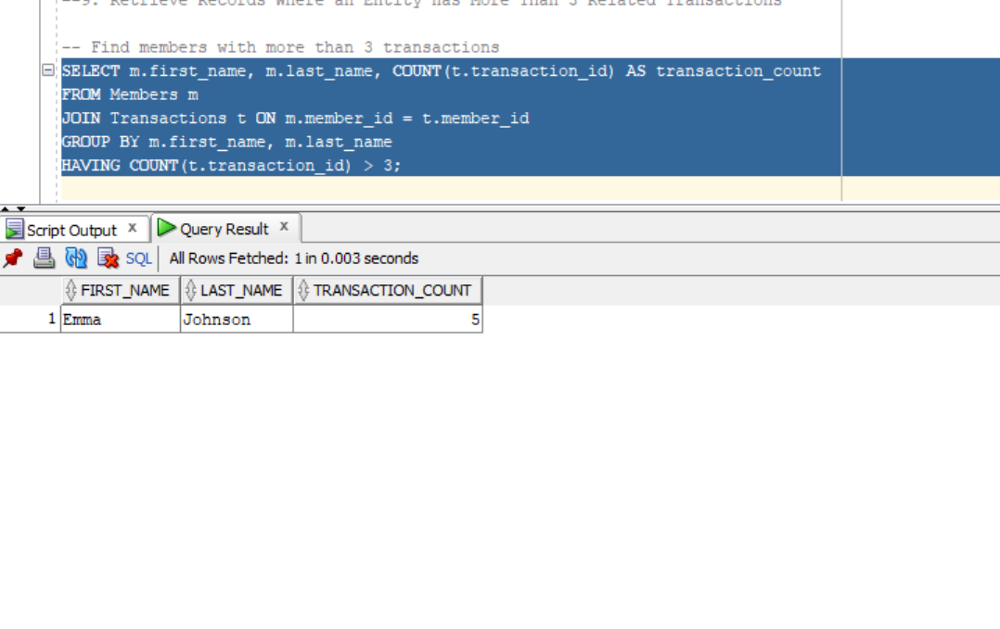

---

## Introduction
- **Student ID**: 27089
- **Names**: ISHIMWE Prince Cuthbert
- **Concentration**: Software Engineering

---


## 📖 About the Project
The **Library Management Database** is a PL/SQL-based project designed to manage a library's operations, including book inventory, authors, members, and transactions. It provides a structured database schema and SQL queries to handle data insertion, updates, deletions, and complex retrievals. This project is ideal for learning and practicing database management using Oracle PL/SQL.

### Problem Statement
Libraries face challenges in managing their inventory, tracking members, and handling borrowing transactions efficiently. Manual systems are error-prone, time-consuming, and lack the ability to generate insights from data. The **Library Management Database** addresses these challenges by providing a robust, automated system to:
- Maintain a catalog of books and their authors.
- Track members and their borrowing activities.
- Manage transactions such as borrowing and returning books.
- Generate reports and insights through advanced SQL queries.

This system ensures efficient data management, reduces manual effort, and provides a scalable solution for libraries of all sizes.


## 🛠 Built With
### Tech Stack
- **Database**: Oracle PL/SQL
- **Tools**: Oracle SQL Developer, Oracle Database

### Key Features
- **Efficient Data Management**: Handles books, authors, members, and transactions seamlessly.
- **Complex Queries**: Supports advanced SQL operations like joins, subqueries, and aggregations.
- **Scalable Design**: Easily extendable to include additional features like publishers or advanced reporting.

---

## 🚀 Live Demo
Since this is a database project, there is no live demo. However, you can run the SQL scripts in an Oracle Database environment to see the project in action.

---

## 💻 Getting Started
To get a local copy up and running, follow these steps.

### Prerequisites
- Oracle Database installed.
- Oracle SQL Developer or any SQL client to execute queries.

### Setup
1. Clone this repository to your desired folder:
   ```bash
    https://github.com/PrinceCuthbert/OracleDatabase/tree/main
Open the SQL scripts in Oracle SQL Developer.

##Install

Create the necessary tables using the CREATE TABLE statements provided in the SQL script.

Insert sample data using the INSERT statements.

##Usage

Execute the SQL queries to perform operations like inserting, updating, deleting, and retrieving data.

Use the provided queries to perform joins, subqueries, and other advanced operations.

##Run Tests

Test the database by running the provided queries and verifying the results.

##Deployment

Deploy the database on an Oracle Database server for production use.


👤 ISHIMWE Prince Cuthbert

GitHub: https://github.com/PrinceCuthbert


LinkedIn:
[[Ishimwe Prince cuthbert]](https://www.linkedin.com/in/ishimwe-prince-cuthbert-8136682b6/)

🔭 Future Features
Advanced Reporting: Add queries to generate reports like most borrowed books, member activity, etc.

User Authentication: Implement a login system for librarians and members.

Fine Calculation: Add functionality to calculate fines for overdue books.

🤝 Contributing
Contributions, issues, and feature requests are welcome! Feel free to check the issues page.

⭐️ Show Your Support
If you find this project useful, please give it a ⭐️ on GitHub! Your support motivates me to keep improving the project.

🙏 Acknowledgments
I would like to thank Oracle for providing the tools and documentation to learn PL/SQL.

Special thanks to my mentors and peers for their feedback and support.

❓ FAQ (OPTIONAL)
Q1: How do I set up this project on my local machine?
A1: Follow the steps in the Getting Started section to set up the database and run the SQL scripts.

Q2: Can I extend this project to include more features?
A2: Yes, the project is designed to be scalable. You can add more tables, queries, and functionality as needed.

📝 License
This project is MIT licensed.


### Sample Query Output






---


     


